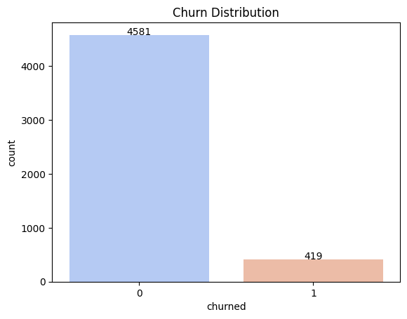
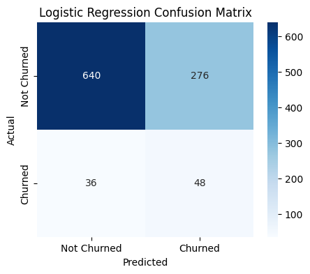
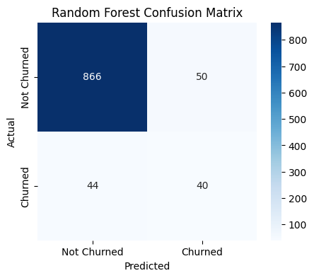
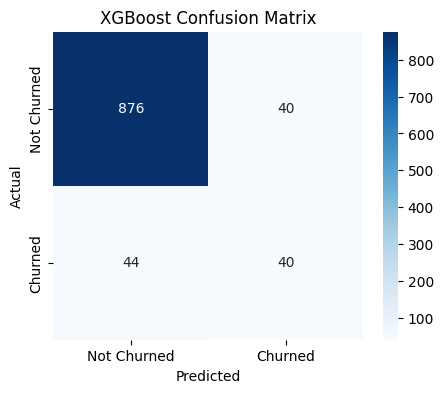
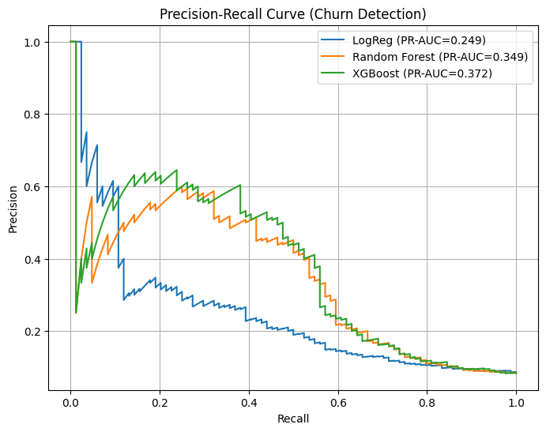
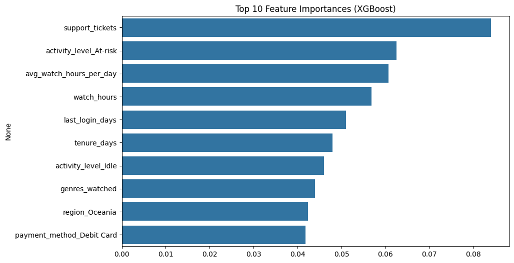

# Netflix Churn Prediction Analysis

## 📖 Overview

This project explores **customer churn prediction** using a synthetic Netflix-style dataset.  
The goal was to simulate a realistic subscription service dataset, analyze customer behavior, and build predictive models to classify which users are likely to churn.

I treated this project as both a **data science learning exercise** and a **portfolio piece**, showcasing my ability to design datasets, apply machine learning models, and extract actionable insights.

---

## 📊 Dataset

- **Base data**: Adapted from a [Kaggle churn dataset](https://www.kaggle.com/datasets/abdulwadood11220/netflix-customer-churn-dataset).
- **Enhancements**: Instead of using evenly distributed features, I wrote **SQL queries** to generate more realistic distributions (e.g., skewed regions, payment methods, activity levels).
- **Final dataset size**: 5,000 customers
  - 4,581 non-churned
  - 419 churned



Key features engineered or controlled:

- `watch_hours`, `avg_watch_hours_per_day`, `last_login_days`
- `activity_level` (Active, At-risk, Idle)
- `support_tickets`
- `subscription_type`
- `region`
- `payment_method`
- `primary_device`
- `tenure_days`
- `multi_device`
- `genres_watched`

---

## 🔍 Exploratory Data Analysis (EDA)

- **Correlation Heatmap**: Visualized relationships between features.
- **Churn Distribution**: Highly imbalanced (≈ 5% churn), reflecting real-world subscription services.
- **Synthetic Control**: Distributions were intentionally shaped through SQL rather than random assignment.

---

## 🤖 Modeling

Three models were trained and compared:

1. **Logistic Regression** (baseline)
2. **Random Forest** (with Optuna hyperparameter tuning)
3. **XGBoost** (with Optuna hyperparameter tuning)

### Confusion Matrices & Metrics

#### Logistic Regression



- Accuracy: **68.8%**
- ROC-AUC: **0.691**
- PR-AUC: **0.249**
- Observation: Strong at predicting non-churn, very weak recall for churned users.

#### Random Forest



- Accuracy: **90.6%**
- ROC-AUC: **0.750**
- PR-AUC: **0.349**
- Observation: Balanced improvement, recall for churn still limited.

#### XGBoost



- Accuracy: **91.6%**
- ROC-AUC: **0.756**
- PR-AUC: **0.372**
- Best F1 at threshold 0.65: **0.488**
- Observation: Best overall trade-off between precision & recall for churners.

### Precision-Recall Curve



- One PR curve compared all three models.
- **XGBoost dominated**, consistently outperforming LR and RF across thresholds.

---

## 🏆 Feature Importances



Top predictors from **XGBoost**:

1. **Support tickets** – strongest churn signal.
2. **Activity level (At-risk / Idle)** – disengagement patterns matter.
3. **Watch hours & average watch hours per day** – content consumption is predictive.
4. **Last login days** – recency of activity strongly tied to churn.
5. **Tenure days** – newer vs. long-term customers show different risks.
6. **Regions & payment methods** – subtle but non-negligible effects.

---

## ✅ Conclusions & Learnings

- **Dataset realism matters**: By reshaping the Kaggle dataset with SQL, I created distributions closer to what a real streaming service might see.
- **Model performance**:
  - Logistic Regression struggled with minority class (churn).
  - Random Forest improved recall, but still conservative.
  - XGBoost, with hyperparameter tuning, gave the best balance of recall and precision.
- **Business insight**:
  - High support ticket counts and inactivity are strong churn signals.
  - Monitoring login recency and watch hours provides actionable churn indicators.

---

## 🚀 Next Steps

- Add better handling of class imbalance (SMOTE, cost-sensitive learning).
- Expand feature engineering (e.g., seasonal viewing patterns, genre affinities).
- Build a deployment-ready pipeline for churn prediction.

---

## 📂 Project Structure

```
├── data/
│   ├── images/          # Any dataset-related images or diagrams
│   ├── input/           # Raw datasets
│   └── output/          # Cleaned or processed datasets
├── notebooks/           # Jupyter notebooks for EDA and churn prediction modeling
├── sql/                 # SQL queries for dataset generation
├── README.md            # Project documentation
```

---

## 💡 Reflection

This project gave me hands-on experience with:

- Designing synthetic datasets with SQL
- Balancing imbalanced classification problems
- Model evaluation using ROC-AUC, PR-AUC, confusion matrices
- Hyperparameter optimization with Optuna
- Storytelling with data
